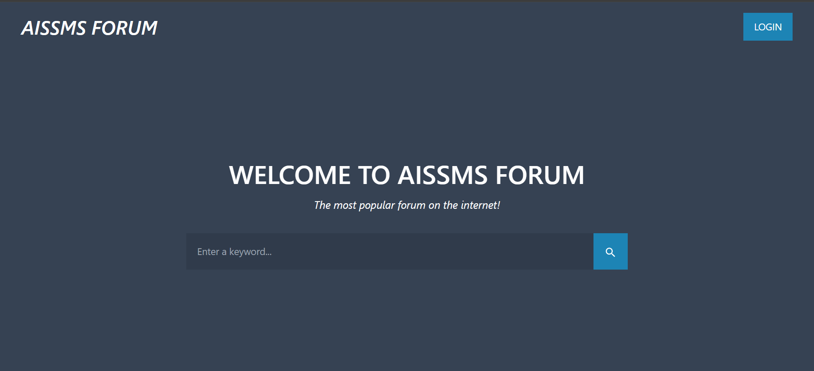
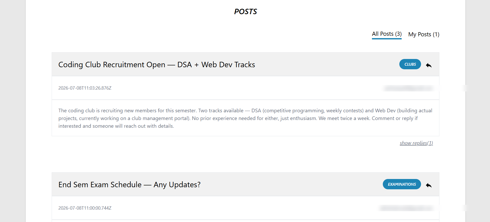
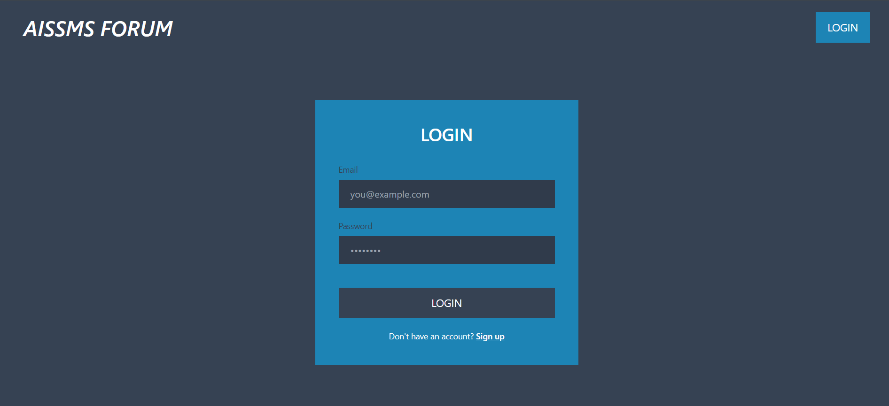
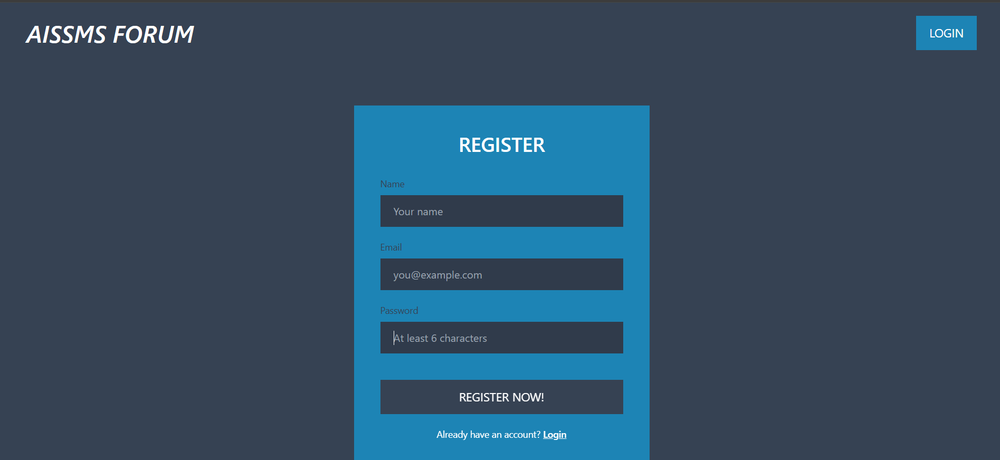

# AISSMS Forum

A full-stack MERN discussion forum where users can register, start discussion threads, reply to posts, and manage their own content. Built as a learning project and later hardened with custom authentication and access control.

**Live demo:** https://forum-ashen.vercel.app

## Features

- User authentication (signup/login/logout) with hashed passwords and JWT sessions stored in httpOnly cookies
- Create, edit, and delete discussion posts, scoped to topics (Examinations, Placements, Scholarships, Sports, Events, Clubs, Other)
- Reply to any post; delete your own replies
- Ownership-based access control — only a post/reply's original author can edit or delete it, enforced on the backend, not just hidden in the UI
- "All Posts" vs "My Posts" filtering
- Live post/topic/reply counters on the homepage
- Responsive design (mobile and desktop) built with Tailwind CSS
- Loading skeletons for a smoother perceived load time

## Tech Stack

**Frontend:** React, React Router, Tailwind CSS, Axios, Material UI Icons
**Backend:** Node.js, Express, Mongoose
**Database:** MongoDB Atlas
**Auth:** JWT (jsonwebtoken), bcrypt password hashing, httpOnly cookies
**Deployment:** Vercel

## Screenshots

**Homepage**


**Posts / Discussions**


**New Post**


**Login**


**Register**


## Getting Started

### Prerequisites
- Node.js (v18+ recommended)
- A MongoDB Atlas cluster (or local MongoDB instance)

### Installation

Clone the repo:
```bash
git clone https://github.com/shmadake/forum.git
cd forum
```

Install backend dependencies:
```bash
npm install
```

Install frontend dependencies:
```bash
cd client
npm install
cd ..
```

### Environment Variables

Create a `.env` file in the project root with:
```
URL=your_mongodb_connection_string
JWT_SECRET=a_long_random_secret_string
PORT=4000
```

Generate a strong `JWT_SECRET` with:
```bash
node -e "console.log(require('crypto').randomBytes(48).toString('hex'))"
```

### Running locally

Start the backend:
```bash
npm start
```

In a separate terminal, start the frontend:
```bash
cd client
npm start
```

The frontend proxies API requests to the backend (see `"proxy"` in `client/package.json`), so make sure the backend is running on the port specified there.

### Building for production
```bash
cd client
npm run build
```
The Express server serves this build folder in production (see `server.js`).

## API Overview

| Method | Endpoint | Auth required | Description |
|---|---|---|---|
| POST | `/api/auth/signup` | No | Register a new user |
| POST | `/api/auth/login` | No | Log in, sets auth cookie |
| POST | `/api/auth/logout` | No | Clear auth cookie |
| GET | `/api/auth/me` | Yes | Get current logged-in user |
| GET | `/api/posts` | No | Get all posts |
| POST | `/api/newpost` | Yes | Create a post |
| PUT | `/api/posts/edit/:id` | Yes (owner only) | Edit a post |
| DELETE | `/api/posts/delete/:id` | Yes (owner only) | Delete a post |
| GET | `/api/replies` | No | Get all replies |
| POST | `/api/posts/reply/:id` | Yes | Reply to a post |
| DELETE | `/api/replies/delete/:id` | Yes (owner only) | Delete a reply |

## Security Notes

- Passwords are hashed with bcrypt before storage — plaintext passwords are never saved
- Auth tokens are stored in httpOnly cookies, not localStorage, reducing exposure to XSS-based token theft
- All write operations (create/edit/delete/reply) require a valid session
- Edit and delete operations verify that the requesting user is the original author before making any change, preventing unauthorized modification of other users' content

## Future Improvements

- Search functionality (UI is present, wiring is pending)
- Pagination for posts and replies
- Rate limiting on auth routes
- Email verification on signup

## License

This project is open source and available for learning purposes.
